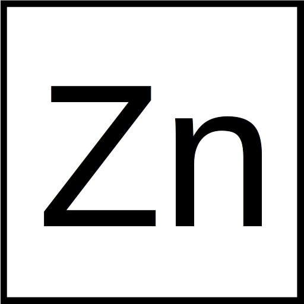

<div align="center">

# Zinc

The zinc programming language.

An successor language to C++.
</div>

---


</a>

## Goals

<sub>Yes, a lot the ideas here are taken from carbon.<sub/>

- Performance-critical
- Software and **language evolution**
- Code that is easy to **read**, **understand**, and **write**
- Perfect and configurable **safety** and testing mechanisms
- Practical **testing** mechanisms
- Fast and **scalable** development
- **Modern** OS platforms, hardware architectures, and environments

- _**Interoperability** with and **migration** from existing C++ code_

In other words, we want to do what C++ does but better.

## How?

Through **interoperability**, **migration**, and **language evolution**.

- Tight move semantics
- Types as an expression
- Explicit object parameter declares a method (the self keyword)
- Type parameters as first class citizens

## (Multiple) inheritance

- `class`
  - Cannot be inherited
  - Able to carry state
  - Can instantiated
  - Able to inherit from multiple traits and mixins
- `mixin`
  - Can be inherited
  - Able to carry state
  - Cannot be instantiated
  - Able to inherit from multiple traits and mixins
  - Similar to an abstract class or pure virtual class with state
- `trait`
  - Can be inherited
  - Unable to carry state
  - Cannot be instantiated
  - Can only inherit / require other traits
  - Entirely comptime construct - does not incur a runtime cost
  - Similar to an interface or pure virtual class without state

## C++ interop

### C++ from zinc

```c++
// circle.h

struct Circle {
    float r;
}
```

```zinc
// math.zinc

:: import cxx "circle.h" as cpp;

:: pub printAreas fn (circles []cpp::Circle) {
    let* area = 0;
    circles.foreach(fn (c) {
        set area += PI * c.r * c.r;
    });
    println("{}", area);
}
```

### Zinc from c++

```c++
// my_cpp.cpp

#include "my_module.zinc.hpp"

void func() {
    my_module::foo();
}
```

```zinc
// my_module.zinc

:: foo fn void {
    println("Hello, world");
}
```

## License

This software is distributed under the terms of both the MIT license and Apache license (Version 2.0) unless any portion is specified otherwise.

See `LICENSE-APACHE`, `LICENSE-MIT`, and `COPYRIGHT` for details.
